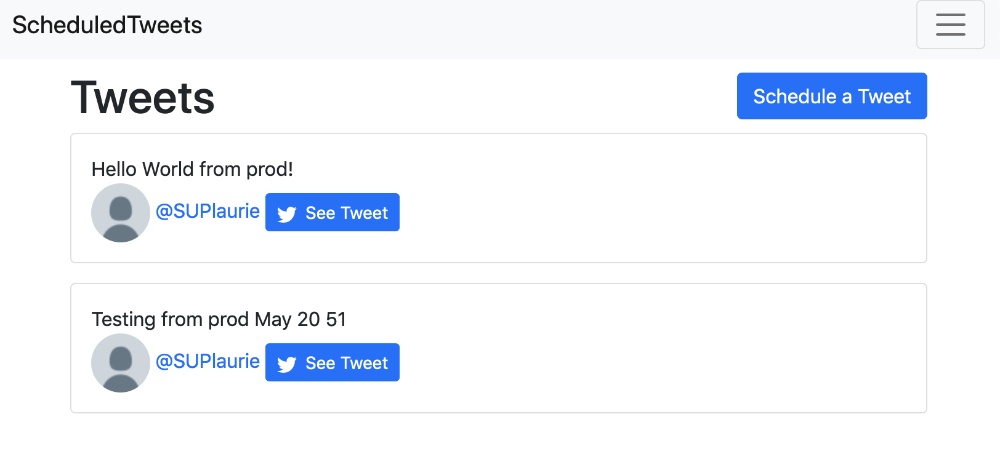
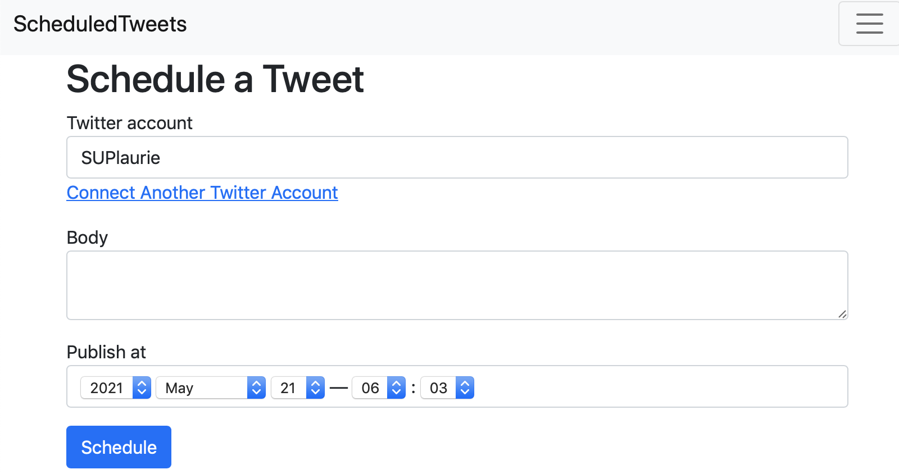
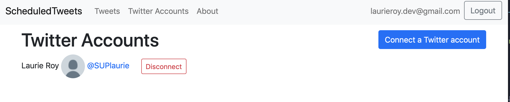

# [Scheduled Tweets](https://laurie-scheduled-tweets.herokuapp.com)

## A buffer clone - Go Rails [tutorial](https://gorails.com/episodes/rails-for-beginners-part-1-installing-ruby-on-rails)

 The tweets tab shows a list of tweets that have been scheduled. The user can edit the tweet, delete it or reschedule.

 The default is 24 hrs from when the button is clicked and the time is listed in GMT/UTC.

 The Twitter Account tab shows the connected twitter accounts. At present only one is connected at a time. I have not verified connecting another twitter account works. yet.

## Try it out!

[Demo](https://laurie-scheduled-tweets.herokuapp.com) on Heroku. It might take a few seconds to spin up.

New Stuff learned:

- signed version of global ID
- using the Twitter API
- localization helper: l
- using the current attributes
- print out var in rails logger: Rails.logger.info auth
- using OmniAuth 2.0 credentials
- create a background job
- using Sidekiq for background jobs

Built with Ruby 3.0.0 on Rails 6.1.1, PG 13 BS 5.0 for the UI.

I had some issues building this one, I had migrated a table without checking, and it had a typo. So dropped the table and rebuilt db. It worked... but it took me a few days of repeating the lessons, and not seeing the issue to figure it out. I saw it wasn't saving to the db, but I thought it was an auth issue with twitter...

Enhancements:
I updated the CSS, moved Bootstrap to local from a CDN and setup the mailer to work on Heroku. This is currenly only used to reset a forgotten password.

